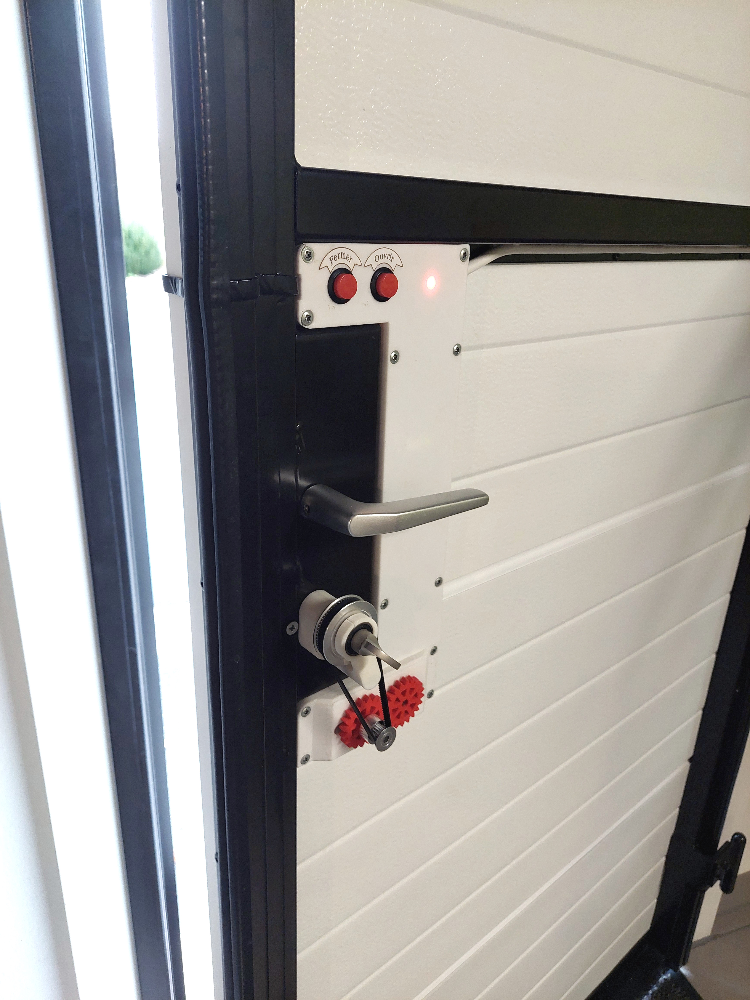
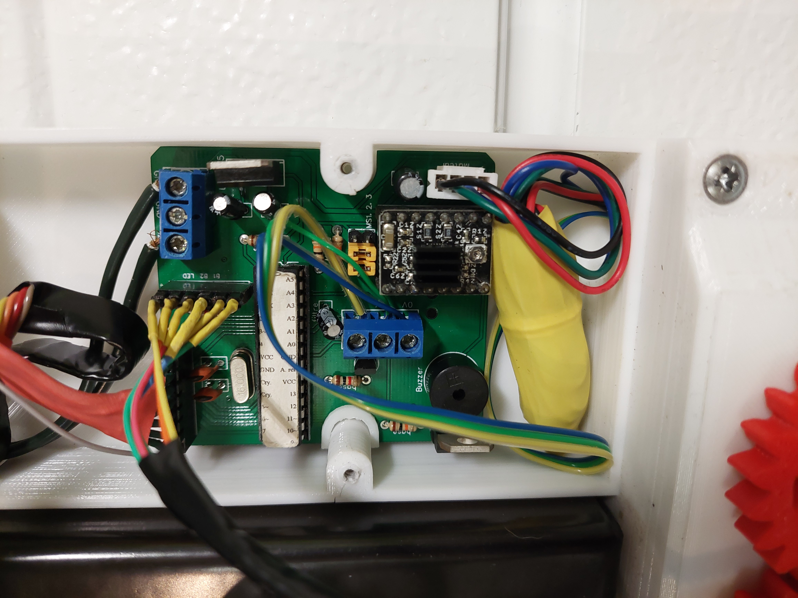
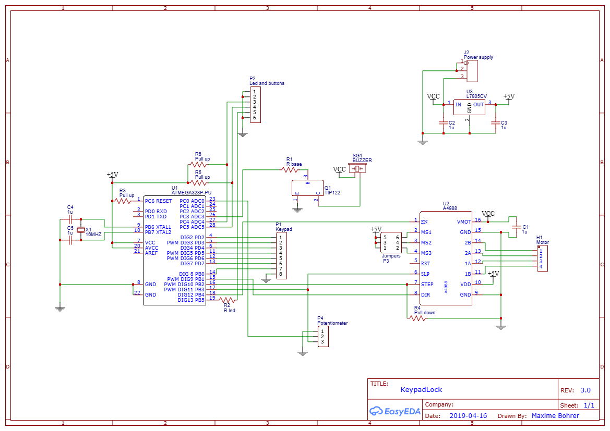
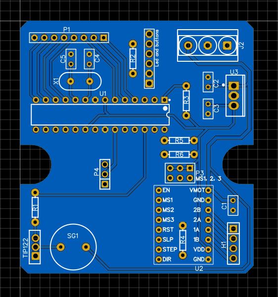
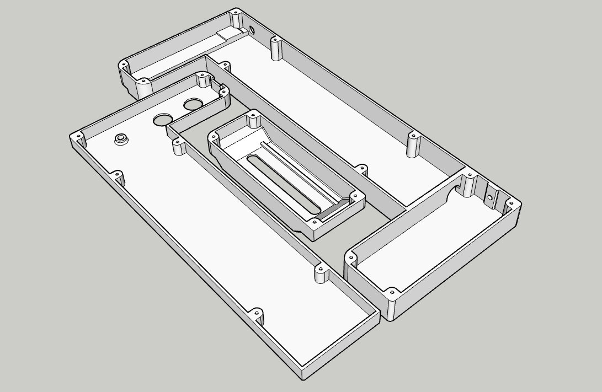

Keypad Door Lock
================

This project turns a conventional door with key into a electronic lock with numerical keypad and password access.



Most keypad locks that can be bought have all the electronics in the keypad in the exterior of the door, only triggering the door opening by sending a signal to a wire. This means they can be bypassed by dismantling the keypad and touching wires manually.

This version only exposes a passive matrix keypad to the exterior, with all the logic used to interpret the keypresses and opening the door in the inside. There is no way to open the door without knowing the combination, even if the keypad is dismanteled. Two buttons in the inside are used to open or close the door without having to enter the conbination.


The system is continuously powered by a 12V supply, which is required for the motor. A LM7805 voltage regulator is used to create 5V for the microcontroller.

The microcontroller used is a Atmel ATmega328P which is the same used in the Adruino Uno and Nano. It is programmed using the Arduino environment.

I needed a motor with the following caracteristics:
- High torque and low speed in a small form factor without the need of a complicated reductor
- Can be rotated by hand when not powered, so that a key can still be used to open the door
- Easily controlled by the microcontroller
The stepper motor is an interesing choice for these reasons, even if we don't necessarily need the precision it offers. It is linked to the key using GT2 pulley and belt with a 3:1 reduction ratio, to get a bit more torque from the motor. The motor is controller by the A4988 IC, to which the microcontroller only has to give step and direction commands.


The system is aware of the position of the key (the rotation angle) with the help of a potentiometer. It is a 10 turn potentiometer (the key has to be able to do multiple full rotations in the door) that is effectively used as a obsolute encoder. It is connected to the key via a 1:1 ratio.


One LED and buzzer are additionaly used to give feedback to the user.

The PCB was designed on EasyEDA and printed by JLCPCB.



The case was designed to fit the door and was 3D-printed. Is has a place for the power supply, PCB, motor and potentiometer, and space for routing cables. It includes a mecanism to tension the GT2 belt by moving the motor+potentiometer block.


Material list
-------------

- ATmega328P with crystal and capacitors
- Nema 17 stepper motor
- A4988 controller
- 12V 5A power supply
- GT2 20-tooth pulley
- GT2 60-tooth pulley
- GT2 280 mm belt
- 8 mm shaft
- 8 mm ball bearing
- 10-turn potentiometer
- 12V 2A power supply
- 12-key keypad
- Red LED
- 2 buttons
- 3D-printed enclosure
- 3D-printed gears
- Custom made PCB
- Wires, screws, etc.

User manual
-----------

```
┌── Log In and Open Door ─────────────────────────────────────────┐
│   ‾‾‾‾‾‾‾‾‾‾‾‾‾‾‾‾‾‾‾‾                                          │
│ You must first unlock the system before you can use any of      │
│ the following commands (except close door)                      │
│  *  0 0 1 2 3 4 5 0 0  #                                        │
│ └┬┘└──────────────┬──┘└─┘                                       │
│  └ start system   └ type the password                           │
│                                                                 │
├── Open Door ───────────────────┬── Close Door ──────────────────┤
│   ‾‾‾‾‾‾‾‾‾                    │   ‾‾‾‾‾‾‾‾‾‾                   │
│ To open the door, use the      │ To close the door, use the     │
│ following command              │ following command              │
│  1  #                          │  0  #                          │
│ └─┘└─┘                         │ └─┘└─┘                         │
│                                │                                │
├── Change Password ─────────────┴────────────────────────────────┤
│   ‾‾‾‾‾‾‾‾‾‾‾‾‾‾‾                                               │
│ To set a new password                                           │
│  7 7 7 1  0 0 1 2 3 4 5 0 0  #                                  │
│ └───────┘└────────┬────────┘└─┘                                 │
│                   └ new password (4 - 12 characters)            │
│                                                                 │
├── Set Trajectory ───────────────────────────────────────────────┤
│   ‾‾‾‾‾‾‾‾‾‾‾‾‾‾                                                │
│ To reset the trajectory and set its first point                 │
│ Move the key to the first position (door fully closed)          │
│ and type the following command                                  │
│  7 7 7 2  #                                                     │
│ └───────┘└─┘                                                    │
│                                                                 │
│ To set the next points (at least 2 in total and up to 10)       │
│ Move the key to the next position and chose the speed at        │
│ which the motor will reach that point                           │
│  7 7 7 2  1 0 0 0  #                                            │
│ └───────┘└───┬───┘└─┘                                           │
│              └ speed to get there in Hz (30 - 10000)            │
│                                                                 │
│ Example with 4 points                                           │
│   7772            77723000          77721000          77723000  │
│     ├─────────────────┼─────────────────┼─────────────────┤     │
│     ↑    ←3000 Hz→    ↑    ←1000 Hz→    ↑    ←3000 Hz→    ↑     │
│ first point     intermediate      intermediate       last point │
│ (door fully         point             point         (door fully │
│   closed)                                              open)    │
│                                                                 │
├── Set Acceleration ─────────────────────────────────────────────┤
│   ‾‾‾‾‾‾‾‾‾‾‾‾‾‾‾‾                                              │
│ To set the rate at which the motor speeds up and slows down     │
│  7 7 7 3  1 0 0 0 0  #                                          │
│ └───────┘└────┬────┘└─┘                                         │
│               └ acceleration in Hz/s (500 - 60000)              │
│                                                                 │
├── Set Timeout ──────────────────────────────────────────────────┤
│   ‾‾‾‾‾‾‾‾‾‾‾                                                   │
│ If the motor can't turn the key and is blocked for this         │
│ amount of time, it will stop and signal the fault               │
│  7 7 7 4  1 0 0 0  #                                            │
│ └───────┘└───┬───┘└─┘                                           │
│              └ timeout value in ms (10 - 5000)                  │
│                                                                 │
├── Installation ─────────────────────────────────────────────────┤
│   ‾‾‾‾‾‾‾‾‾‾‾‾                                                  │
│ The motor must be wired such that it turns in the right         │
│ direction when the OPEN and CLOSE buttons are pressed.          │
│                                                                 │
│ The potentiometer must be wired such that its voltage is at     │
│ its lowest when the door is closed, and increases as the door   │
│ opens.                                                          │
│                                                                 │
└─────────────────────────────────────────────────────────────────┘
```

Programming
-----------

To program microcontrollers in the Arduino envorinment you can use the Arduino IDE, the Arduino extension in VS code, PlatformIO, etc. I used the Arduino IDE.

There are two options to flash a standalone microcontroller:
- The default option: the upload button in the Arduino IDE flashes the program via the serial port (RX and TX pins). This requires a special bootloader on the microcontroller, already preinstalled on Arduino boards, whose job is to listen to the serial port when the microcontroller starts: if something is available, it writes the new program to memory, if not, it justs starts the existing one. [More information](https://docs.arduino.cc/retired/hacking/hardware/building-an-arduino-on-a-breadboard/)
- Flashing using an AVR programmer: it's a chip that directly writes a program to the microcontroller by using its programming pins. To do that we use the "upload via programmer" option of the Arduino IDE. The appropriate programmer has to be chosen in the list. We can even use another Arduino board as a programmer by flashing the ArduinoISP program to it, connecting the correct pins to the microcontroller, and selecting the "Arduino as ISP" programmer in the list. In this case the Arduino bootloader is no longer needed. If we want to use the microcontroller in an Arduino board again, we must use the "burn bootloader" option. [More information](https://docs.arduino.cc/built-in-examples/arduino-isp/ArduinoToBreadboard/)

Electric schematic and PCB
--------------------------

The electric schematic and PCB were created using EasyEDA and printed by JLCPCB.




3D models
---------

The 3D models were created using Sketchup.

